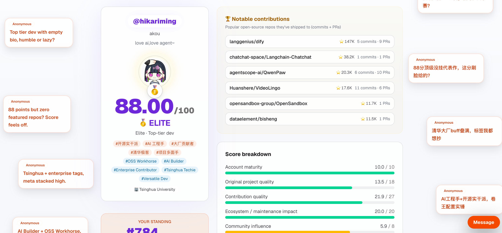
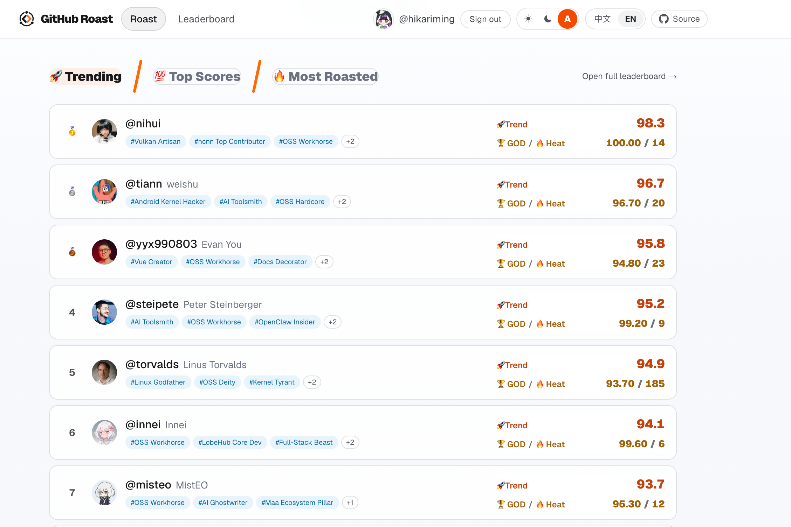

<div align="center">

# GitHub Roast 🔥

### Roast the profile. Read the signal. Find the builders.

An evidence-based GitHub developer assessment, discovery, and showcase platform.

Turn any public GitHub profile into a **0–100 value & trust score**, an honest roast, and a shareable developer card — then explore noteworthy builders, like-minded peers, and worthy rivals across the community.

**English** · [中文](./README.zh.md)

[**🔥 Roast a GitHub profile**](https://ghfind.com/en) · [**🏆 Explore developers**](https://ghfind.com/en/leaderboard) · [**⭐ View source**](https://github.com/hikariming/github-roast)

</div>

[](https://ghfind.com/en/u/hikariming)

## Assess. Discover. Show off.

### 🔥 Get a developer signal in 30 seconds

Enter a GitHub handle to get a **0–100 value & trust score**, a five-tier verdict (🏆 GOD / 🥇 ELITE / 💪 SOLID / 🫥 NPC / 💩 TRASH), and a brutally honest roast grounded in public data. Six scoring dimensions and ten farming red flags help separate sustained engineering work from star farming, fork hoarding, bots, and self-merged PRs.

### 🧭 Discover developers worth knowing

GitHub Roast is more than a scoring tool. Use the leaderboard and public profiles to find strong open-source contributors, builders in your ecosystem, potential collaborators, and the developers you want to measure yourself against.

[](https://ghfind.com/en/leaderboard)

### 🪪 Turn your GitHub work into a shareable identity

Every assessment can generate a live badge and light/dark developer card for your GitHub profile, project README, portfolio, or personal site. Here is a real example:

<div align="center">

[](https://ghfind.com/en/u/hikariming)

<a href="https://ghfind.com/en/u/hikariming">
  <picture>
    <source media="(prefers-color-scheme: dark)" srcset="https://ghfind.com/api/card/hikariming?theme=dark">
    <source media="(prefers-color-scheme: light)" srcset="https://ghfind.com/api/card/hikariming?theme=light">
    
  </picture>
</a>

</div>

The scoring core comes from the open-source Claude skill `github-account-value`. This site **ports its Python scoring logic line-by-line into TypeScript**, with unit tests locking the two outputs in parity.

## How it works

```
browser ─▶ /api/scan ─▶ [Redis cache?] ─▶ lib/github.ts  (GitHub REST + GraphQL, operator PAT)
                                     └─▶ lib/score.ts   (deterministic scoring, parity with the Python skill)
                                     └─▶ write cache 24h
         ─▶ /api/roast (streaming) ─▶ LLM judge pass (bounded score calibration)
                                      └─▶ LLM writer pass (roast/report text only)
                                      └─▶ lib/llm.ts (OpenAI-compatible; defaults to StepFun; bring-your-own key)
```

- **The base score is deterministic** — computed server-side by `lib/score.ts`.
- The LLM runs in two separated passes: a factual judge may apply a bounded **±10** calibration, then a writer turns the fixed result into tags, the top roast line, and the report. The writer cannot change the score.
- 6 dimensions (account maturity / original project quality / contribution quality / ecosystem impact / community influence / activity authenticity) + 10 farming red flags. Weights lean toward **hard-to-fake** signals (PRs merged into real repos, sustained activity) and discount **buyable** ones (stars, followers).
- The site also includes share cards, README badges, profile comments, and GitHub-authenticated profile reactions.

## Local development

```bash
pnpm install
cp .env.example .env.local   # set GITHUB_TOKEN and LLM_API_KEY (defaults to StepFun)
pnpm dev
```

> **Always set `GITHUB_TOKEN`.** Without a token, GitHub's GraphQL dimensions (contributions / activity / external contributions) all drop to zero (scores get badly underestimated), and REST is rate-limited to 60/h. A read-only PAT raises the limit to 5000/h and unlocks every dimension.

### Commands

| Command | Description |
|------|------|
| `pnpm dev` | Local development |
| `pnpm start` or `pnpm build/start` | One-command production build + run |
| `pnpm build` / `pnpm start:prod` | Build only / run an existing production build |
| `pnpm github-roast` | Agent-friendly CLI wrapper around the website `/api/scan` + `/api/roast` APIs |
| `pnpm test` | Vitest test suite (scoring, prompts, DB, UI helpers, reactions, etc.) |
| `pnpm typecheck` | `tsc --noEmit` |
| `pnpm lint` | ESLint |

### Agent CLI

The CLI is a thin remote wrapper around the public website APIs. It does **not**
run GitHub scanning, scoring, or LLM logic locally.

```bash
pnpm github-roast commands --json
pnpm github-roast score hikariming -o json
pnpm github-roast roast hikariming --lang en -o markdown
```

For a standalone binary:

```bash
pnpm cli:build
./bin/github-roast commands --json
./bin/github-roast roast hikariming --lang en -o markdown
```

The default service host is `https://ghfind.com`. Override it for local dev:

```bash
GITHUB_ROAST_HOST=http://localhost:3000 pnpm github-roast roast hikariming --lang en
```

Production `/api/scan` uses Turnstile for browser calls. For agent/CLI calls,
set `GITHUB_ROAST_CLI_API_KEY` on the server and pass the same value to the CLI
as `GITHUB_ROAST_API_KEY` or `--api-key`; the CLI sends it as
`Authorization: Bearer ...` to the same `/api/scan` endpoint.

## Environment variables

See [`.env.example`](./.env.example). The minimum to run the GitHub roast flow is `GITHUB_TOKEN` + `LLM_API_KEY` (defaults to StepFun, OpenAI-compatible; swap in any OpenAI-compatible service). Cache, rate limiting, human verification, GitHub login, profile comments/reactions, and the leaderboard **degrade silently** when unconfigured (fine for local). Configure everything for production.

## Leaderboard + percentile (Turso, optional)

Configure `TURSO_*` to unlock the "Hall of Fame" leaderboard (`/leaderboard`) and the result page's "🏆 You beat X% of developers".
Each scan upserts the account's latest score into the DB (one row per account); percentile = the share of stored scores strictly below yours.
**The public board only lists accounts scoring ≥60**; lower scores still count toward the percentile but are not publicly named (anti-harassment). The whole feature degrades silently when unconfigured.

```bash
# cloud
turso db create github-roast
turso db tokens create github-roast   # gives TURSO_DATABASE_URL(libsql://...) + TURSO_AUTH_TOKEN
# local dev, no cloud
TURSO_DATABASE_URL=file:./local.db
```

## Deploy to Vercel

1. Push to GitHub, import in Vercel.
2. Configure environment variables (as above). `UPSTASH_*` can be provisioned in one click via Vercel's Upstash integration.
3. Grab a Cloudflare Turnstile site/secret key pair; set `NEXT_PUBLIC_TURNSTILE_SITE_KEY` + `TURNSTILE_SECRET_KEY`.
4. (Optional) Turso: `TURSO_DATABASE_URL` + `TURSO_AUTH_TOKEN` to enable the leaderboard, archived reports, and profile comments/reactions.
5. (Optional) GitHub OAuth: `AUTH_GITHUB_ID` + `AUTH_GITHUB_SECRET` + `AUTH_SECRET` to enable signed-in comments/reactions.
6. (Optional) set `PUBLIC_SITE_URL` when deploying under a custom domain so metadata, sitemap, cards, and LLM attribution use the right origin.
7. Deploy.

## Bring your own model / API key

Click "Use your own model" on the page and enter Base URL + API Key + Model. Compatible with any OpenAI-style API (OpenAI / OpenRouter / Groq / DeepSeek / local). **The key lives only in your own browser's localStorage, is passed directly on call, and is never uploaded to the server or persisted.**

## Regenerating the scoring-parity test baseline

`src/lib/__tests__/score-fixtures.json` is the ground truth produced by the Python skill's `score()`. After the skill formula changes, re-run `score()` from `github-account-value/scripts/fetch_github_profile.py` on the same inputs, overwrite that file, then `pnpm test` to verify the port didn't drift.

## Disclaimer

This site generates scores and commentary automatically from **public GitHub data only**. It roasts an account's public behavior and data, is not directed at individuals, does not constitute a factual finding, and must not be used for harassment. Private contributions are excluded, so active members of private orgs may be underrated.

## Sponsorship & fairness

Sponsorship is welcome to cover running costs (GitHub API, LLM, hosting). Note that:

- **Sponsorship does not affect any score or ranking.** Scores are computed deterministically by `src/lib/score.ts`; sponsors cannot buy a higher score, a better rank, or "whitewashing". Sponsor placements and leaderboard data are physically separated in the product.
- Sponsor perks are attribution/placement only and never touch the scoring logic.

## License

Licensed under **[GNU AGPL-3.0](./LICENSE)**.

- You may freely use, modify, and self-host this project.
- **If you modify it and offer it as a network service** (SaaS / hosted), AGPL requires you to **release your modifications under AGPL as well** (users interacting over the network are entitled to the source).
- The scoring core is ported from the open-source Claude skill `github-account-value`, kept as the single source of truth.

> **Trademark:** the "GitHub Roast / 毒舌 GitHub 评分" name, logo, and domain are **not covered** by the open-source license; all rights reserved. You may self-host from this code, but please do not use the project's name/brand to impersonate the official site or cause confusion.
