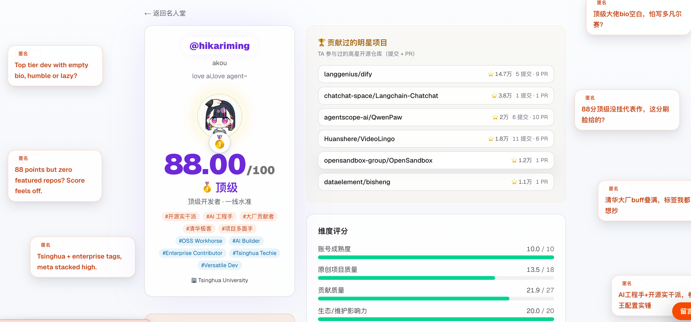

<div align="center">

# 毒舌 GitHub 评分 🔥

### 看穿账号成色，发现同路高手，晒出开发者身份。

一个基于真实公开数据的 GitHub 开发者测评、发现与展示平台。

把任意公开 GitHub 账号变成 **0–100 分价值与信任评分**、一份不留情面的锐评和一张可分享的开发者卡片；也可以在社区里发现值得关注的开发者、同领域伙伴，以及值得较量的「对家」。

[English](./README.md) · **中文**

[**🔥 测测 GitHub 成色**](https://ghfind.com) · [**🏆 发现更多开发者**](https://ghfind.com/leaderboard) · [**⭐ 查看源码**](https://github.com/hikariming/github-roast)

</div>

[](https://ghfind.com/u/hikariming)

## 测评、发现、展示，一站完成

### 🔥 30 秒看清一个 GitHub 账号

输入 GitHub 用户名，即可得到 **0–100 分**的价值与信任评分、五档等级（🏆 夯 / 🥇 顶级 / 💪 人上人 / 🫥 NPC / 💩 拉完了），外加一句扎在公开数据上的毒舌点评。六大评分维度与十类刷量信号，专治刷星号、AI 机器人、收藏夹开发者，以及自产自销自审自合的 PR farmer。

### 🧭 发现值得认识的开发者

这里不只负责打分。你可以通过排行榜和公开开发者主页，找到真正活跃的开源贡献者、同技术栈伙伴、潜在合作者，也能看看那些与你旗鼓相当、值得较量的「对家」。

[](https://ghfind.com/leaderboard)

### 🪪 把开发经历变成可炫耀的身份卡

每次测评都可以生成实时更新的评分徽章，以及适配明暗主题的开发者大卡。把它放进 GitHub 个人主页、项目 README、作品集或个人网站，让公开贡献替你说话。下面就是一个真实示例：

<div align="center">

[](https://ghfind.com/u/hikariming)

<a href="https://ghfind.com/u/hikariming">
  <picture>
    <source media="(prefers-color-scheme: dark)" srcset="https://ghfind.com/api/card/hikariming?theme=dark">
    <source media="(prefers-color-scheme: light)" srcset="https://ghfind.com/api/card/hikariming?theme=light">
    
  </picture>
</a>

</div>

评分核心来自开源 Claude 技能 `github-account-value`。网站把它的 Python 打分逻辑 **逐行移植成 TypeScript**，并用单元测试锁定二者输出一致。

## 工作原理

```
浏览器 ─▶ /api/scan ─▶ [Redis 缓存?] ─▶ lib/github.ts  (GitHub REST + GraphQL, 运营方 PAT)
                                   └─▶ lib/score.ts   (确定性打分, 与 Python 技能一致)
                                   └─▶ 写入缓存 24h
        ─▶ /api/roast (流式) ─▶ LLM judge pass (受限评分校准)
                                  └─▶ LLM writer pass (只写毒舌与报告)
                                  └─▶ lib/llm.ts (OpenAI 兼容; 默认 StepFun 阶跃; 可自带 Key)
```

- **基础分是确定性的**,由 `lib/score.ts` 在服务端算出。
- 大模型分两层:务实 judge 只做事实复核和**至多 ±10** 的受限校准;writer 只根据固定结果写标签、顶部毒舌和完整报告,不能改分。
- 6 个维度(账号成熟度 / 原创项目质量 / 贡献质量 / 外部生态贡献 / 社区影响力 / 活跃真实性)+ 10 条刷量 red flag,权重向**难以造假**的信号(合并进真实仓库的 PR、持续活跃)倾斜,对**可购买**的信号(star、粉丝)压低权重。
- 站点还包含分享卡片、README 小徽章、个人页评论、GitHub 登录后的个人页反应。

## 本地开发

```bash
pnpm install
cp .env.example .env.local   # 填入 GITHUB_TOKEN 和 LLM_API_KEY(默认 StepFun 阶跃)
pnpm dev
```

> **务必配置 `GITHUB_TOKEN`。** 没有 token 时,GitHub 的 GraphQL 贡献/活跃度/外部贡献等维度会全部归零(评分被严重低估),且 REST 限速只有 60/h。一个只读 PAT 即可把限速提到 5000/h 并解锁全部维度。

### 命令

| 命令 | 说明 |
|------|------|
| `pnpm dev` | 本地开发 |
| `pnpm start` 或 `pnpm build/start` | 一键生产构建并运行 |
| `pnpm build` / `pnpm start:prod` | 仅构建 / 运行已有生产构建 |
| `pnpm github-roast` | 面向 agent 的 CLI,封装网站 `/api/scan` + `/api/roast` API |
| `pnpm test` | Vitest 测试套件(打分、prompt、DB、UI helper、reaction 等) |
| `pnpm typecheck` | `tsc --noEmit` |
| `pnpm lint` | ESLint |

### Agent CLI

CLI 是网站 API 的远程调用封装,不会在本地运行 GitHub 扫描、评分或 LLM
逻辑。

```bash
pnpm github-roast commands --json
pnpm github-roast score hikariming -o json
pnpm github-roast roast hikariming --lang zh -o markdown
```

构建独立二进制:

```bash
pnpm cli:build
./bin/github-roast commands --json
./bin/github-roast roast hikariming --lang zh -o markdown
```

默认服务端域名是 `https://ghfind.com`。本地联调可以覆盖:

```bash
GITHUB_ROAST_HOST=http://localhost:3000 pnpm github-roast roast hikariming --lang zh
```

生产环境的 `/api/scan` 对浏览器走 Turnstile。agent/CLI 调用可以在服务端设置
`GITHUB_ROAST_CLI_API_KEY`,并在 CLI 侧用 `GITHUB_ROAST_API_KEY` 或
`--api-key` 传入;CLI 会向同一个 `/api/scan` 端点发送
`Authorization: Bearer ...`。

## 环境变量

见 [`.env.example`](./.env.example)。GitHub 评分流程最小可跑只需 `GITHUB_TOKEN` + `LLM_API_KEY`(默认 StepFun 阶跃,OpenAI 兼容;可换任意 OpenAI 兼容服务);缓存、限流、人机校验、GitHub 登录、个人页评论/反应、排行榜在未配置时会**静默降级**(适合本地)。生产强烈建议全配齐。

## 排行榜 + 百分位(Turso,可选)

配置 `TURSO_*` 后解锁「名人堂排行榜」(`/leaderboard`) 和结果页的「🏆 你超越了 X% 的开发者」。
每次扫描把账号的最新分数 upsert 进库(一账号一行);百分位 = 库里分数严格低于你的占比。
**公开榜只收录 ≥60 分的账号**,低分号仍参与百分位统计但不被公开点名(防骚扰)。未配置时整套功能静默降级。

```bash
# 云端
turso db create github-roast
turso db tokens create github-roast   # 得到 TURSO_DATABASE_URL(libsql://...) + TURSO_AUTH_TOKEN
# 本地开发免云
TURSO_DATABASE_URL=file:./local.db
```

## 部署到 Vercel

1. Push 到 GitHub,在 Vercel 导入。
2. 配置环境变量(同上)。`UPSTASH_*` 用 Vercel 的 Upstash 集成一键开通。
3. Cloudflare Turnstile 拿一对 site/secret key,配 `NEXT_PUBLIC_TURNSTILE_SITE_KEY` + `TURNSTILE_SECRET_KEY`。
4. (可选)Turso:`TURSO_DATABASE_URL` + `TURSO_AUTH_TOKEN` 开排行榜、归档报告、个人页评论/反应。
5. (可选)GitHub OAuth:`AUTH_GITHUB_ID` + `AUTH_GITHUB_SECRET` + `AUTH_SECRET` 开启登录评论/反应。
6. (可选)自定义域名部署时设置 `PUBLIC_SITE_URL`,保证 metadata、sitemap、卡片和 LLM attribution 使用正确域名。
7. Deploy。

## 自带模型 / API Key

点页面上的「用自己的模型」,填 Base URL + API Key + Model。兼容任意 OpenAI 接口(OpenAI / OpenRouter / Groq / DeepSeek / 本地)。**Key 只存在你自己的浏览器 localStorage,调用时直传,绝不上传到服务器、绝不落库。**

## 重新生成打分一致性测试的基准

`src/lib/__tests__/score-fixtures.json` 是用 Python 技能的 `score()` 跑出来的 ground truth。技能公式更新后,用 `github-account-value/scripts/fetch_github_profile.py` 的 `score()` 对相同输入重跑并覆盖该文件,再 `pnpm test` 验证移植未走样。

## 免责声明

本站仅基于 GitHub **公开数据**自动生成评分与点评,吐槽的是账号的公开行为与数据,非针对个人,不构成事实认定,请勿用于骚扰。私有贡献不计入,可能低估私有组织的活跃员工。

## 赞助与公正性声明

本项目欢迎赞助以覆盖运营成本(GitHub API、大模型、托管)。但请注意:

- **赞助不影响任何评分与排名。** 分数由 `src/lib/score.ts` 确定性算出,赞助方无法购买更高的分数、排名或「洗白」。赞助位与榜单数据在产品中物理隔离。
- 赞助方权益仅为署名/展示位,不涉及评分逻辑。

## 开源协议

本项目采用 **[GNU AGPL-3.0](./LICENSE)** 开源协议。

- 你可以自由使用、修改、自部署本项目。
- **若你修改本项目并以网络服务形式对外提供**(SaaS / 在线服务),AGPL 要求你**同样以 AGPL 开源你的修改版**(包括通过网络交互的用户也有权获取源码)。
- 评分核心移植自开源 Claude 技能 `github-account-value`,保持单一事实来源。

> **商标声明:** 「GitHub Roast / 毒舌 GitHub 评分」名称、Logo 及域名**不在本开源协议授权范围内**,版权保留。你可以基于本代码自部署,但请勿使用本项目的名称/品牌冒充官方或制造混淆。
